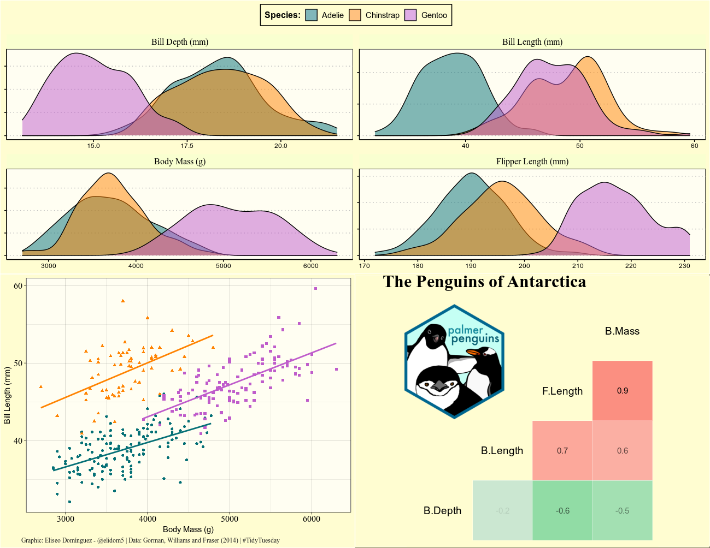
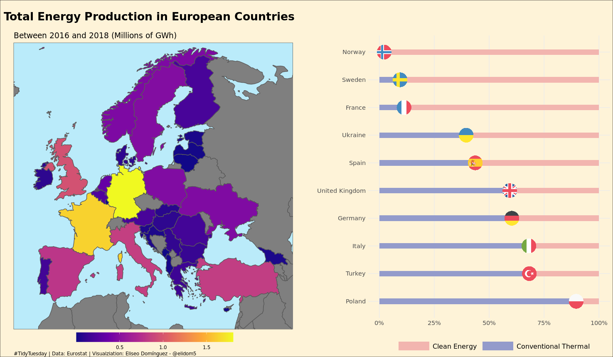

During the pandemic lockdown, I found [TidyTuesday](https://github.com/rfordatascience/tidytuesday/blob/master/README.md), an amazing online community dedicated to data visualization with the R Tidyverse. Each week, members produce creative visualizations from the same data set and share their code, making it easy for people like me to learn from others. Here, I share some of my contributions to this weekly activity.

### The Penguins of Antarctica

[Code.](https://github.com/elidom/my_TidyTues/blob/master/TidyTues_31_PalmerPenguins.Rmd)  
  

### Energy Production in European Contries

[Code.](https://github.com/elidom/my_TidyTues/blob/master/TidyTues_32_Energy.Rmd)

