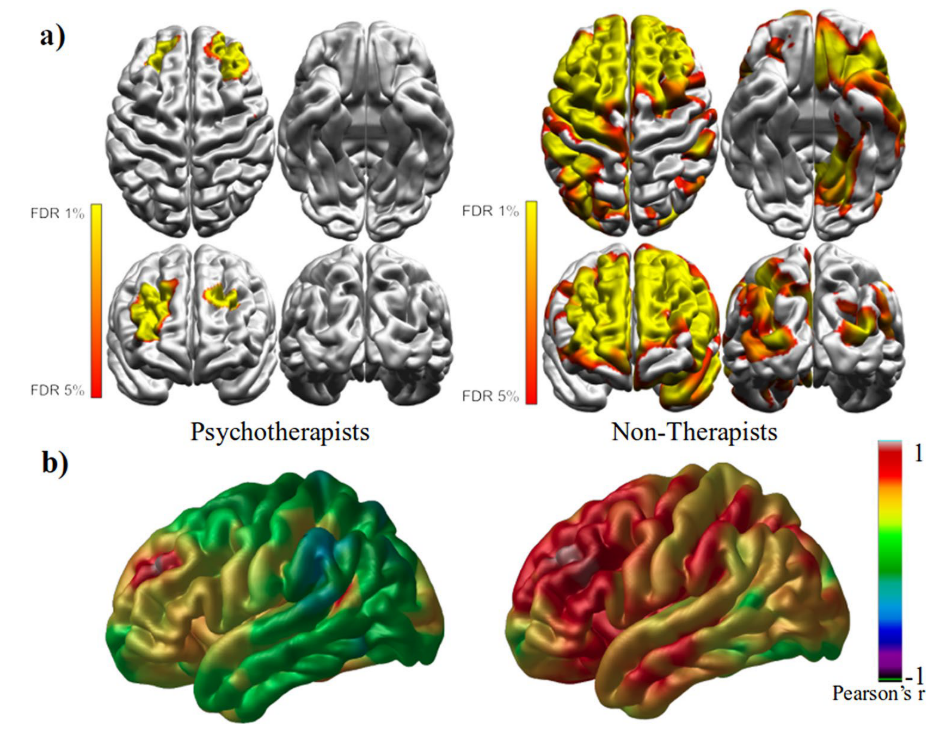

## Current Projects:

### The Perception of Value in Spoken Interactions

We tend to find some conversations more memorable and certain conversation partners more engaging than others. Just as we have preferences for different music styles, we also have preferences for certain speaking styles over others. As speakers, we understand this, at least implicitly. Through the way we speak, we can convey information about our dispositions and emotional states. For example, we may adjust our speech if we aim to foster a positive and sustained interaction with someone, as opposed to when we want it to end as soon as possible. This may then have consequences on the behavioral and cognitive dynamics of the interaction. My PhD thesis is concerned with this. Namely, how we perceive value in everyday conversations. Some of the questions driving my research are: How can we approximate the perceived value of conversational speech? What constitutes an engaging spoken interaction? What is the relative contribution of semantics and prosody to the perceived value of conversational utterances? Is inter-speaker biobehavioral synchrony linked to a more valued interaction?

### The Neurocognitive Responses to Praise and Critique in Foreign-Accented Speech

Effective emotional communication is a crucial part of our social life and has a significant impact on how we interact with others and make decisions. This involves having the capacity to praise and, on occasion, criticize others. However, in societies where interactions increasingly occur across cultural and linguistic boundaries, a foreign accent can add a layer of complexity to these types of communication. Indeed, recent evidence suggests that the presence of a foreign accent triggers biased neurocognitive processing of speech due, potentially, to the effects of social categorization, implicit bias, and processing fluency. There is also evidence that the linguistic context, including the speaker's accent, influences the perceived emotionality of spoken utterances.

## Past Projects:

### The Brain Structural Correlates of Empathic and Emotion Regulation Capacities.
Experience shapes the brain. What is more, numerous research groups have shown that neuroimaging techniques can identify structural changes in the brain that correspond to varying external demands and individual differences. Such anatomical differences can be linked to capacities and experiences, such as in spatial navigation (Maguire et al., 2000), music (Bermudez & Zatorre, 2005), and motor coordination (Draganski et al. 2004). My master's thesis project was concerned with whether experiences and skills in the social and affective domains could also be linked to anatomical differences in the cerebral cortex (although, as my wording implies, without establishing a causal link at this point). To investigate this, we used MRI scans to calculate the cortical thickness across the brains of professional psychotherapists and compared them to a control group. We chose to study psychotherapists because their training typically involves the ability to explicitly modulate their emotional response and they have been found to display increased empathic and emotion regulation skills. 

A strength of this study is that we used and compared two cortical thickness estimation pipelines: CIVET and FreeSurfer. Both methods provided evidence of a statistically significant difference between psychotherapists and non-therapists in the left dorsolateral prefrontal cortex (dlPFC). This finding is meaningful because the dlPFC plays a crucial role in emotion regulation and cognitive empathy processes (e.g., empathic perspective-taking). Moreover, a structural covariance analysis revealed that in psychotherapists, the cortical thickness in this region varied relatively independently from the rest of the cortex. This research has been published as an article, which you can find [here](https://doi.org/10.1007/s10548-022-00910-3).

      _**Structural covariance**: **A.** Vertices significantly correlated with dlPFC seed vertex (FDR corrected at 5%) in each group. **B.** - Pearson’s r statistical map showing how a dlPFC seed vertex correlates with the rest of the vertices in the left hemisphere._

