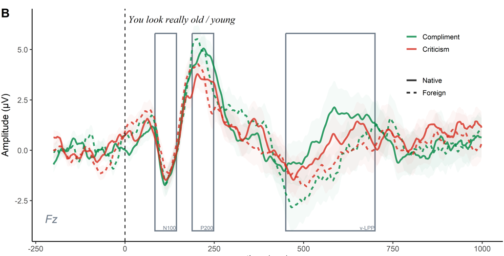

## Current Projects:

### From What We Value to How We Coordinate in Conversation

We tend to find some conversations more enjoyable and certain conversation partners more engaging than others. Similar to our preferences for various types of music, we also favor certain conversation topics and speaking styles. As speakers, we implicitly know that through the way we speak, we can convey information about our relational dispositions and affective states (e.g., [Coker & Burgoon, 1987](https://onlinelibrary.wiley.com/doi/abs/10.1111/j.1468-2958.1987.tb00115.x); [Pell & Kotz, 2021](https://journals.plos.org/plosone/article?id=10.1371/journal.pone.0027256)). For example, we may adjust our vocal characteristics if we aim to foster a positive and sustained interaction with someone, as opposed to when we want it to end as soon as possible. This may then have consequences on the behavioral and cognitive dynamics of the interaction ([Pérez & Davis, 2023](https://www.sciencedirect.com/science/article/pii/S0010945222003252)). My PhD research focuses on **understanding how we perceive and respond to the social value of everyday conversations**, using a combination of behavioral, neuroimaging, and two-person methodologies across three studies.

First, we examined the effects of vocal markers of relational stance on the perceived social value of spoken interactions. In this study, we examined the vocal acoustic profile of untrained speakers when trying to foster positive interpersonal outcomes in the context of a social interaction with an acquaintance. We also assessed how this positive relational stance affected the perceived social value of a conversation, differentiating between *affiliation* value (the speaker's appeal as social partner) and *reward* value (how enjoyable an interaction is). In addition, we assessed the relative roles of the semantic and relational context of a conversation in shaping its perceived value. Inspired by earlier auction-based approaches, we established an index of social reward value using *time bids*, which quantify how much time a listener is willing to allocate to extending an interaction. This work is currently *under review*.

Next, we investigated how the brain encodes conversational anecdotes with differing levels of perceived value. Neural speech tracking (a.k.a. cortical entrainment) is a signal encoding mechanism modulated by both bottom-up (e.g., stimulus acoustics) and top-down (e.g., attention) processes. In this study, we analyzed EEG neural tracking as listeners engaged with anecdotes varying in topic interest (interesting vs. boring) and speaker tone (neutral vs. engaging). Time-bidding responses were also gathered, supporting the primary findings from the first study. This method allowed us to map the temporal and spatial dynamics of cortical speech encoding and their link to the perceived value of the conversation and speaker. This work is currently *under review*.

Finally, we are conducting an EEG [hyperscanning](https://www.frontiersin.org/journals/human-neuroscience/articles/10.3389/fnhum.2020.00039/full) experiment in which we record brain activity from pairs of participants (dyads) during a series of short conversations. The participants are unacquainted and remain unseen by each other throughout the experiment. Based on a prior screening of their interest in a broad range of conversation topics, participants engage in naturalistic, free-form discussions about topics they are both highly passionate about or entirely disinterested in. This design allows us to elicit distinct levels of perceived value in the interactions and examine the resulting patterns of vocal and neural coordination between the participants.

## Past Projects:

### The Neurocognitive Responses to Foreign-Accented Compliments and Criticisms

Effective emotive communication is a crucial part of our social lives. This involves the ability to compliment and, on occasion, criticize others. However, in societies where interactions increasingly occur across cultural and linguistic boundaries, a foreign accent can add a layer of complexity. Recent evidence suggests that the presence of a foreign accent triggers biased neurocognitive processing of speech ([Foucart & Hartsuiker, 2021](https://www.sciencedirect.com/science/article/pii/S0028393221001536?via%3Dihub)). This is potentially due to rapid social categorization of the speaker and implicit bias (see, e.g., [Lev-Ari, 2014](https://www.frontiersin.org/journals/psychology/articles/10.3389/fpsyg.2014.01546/full)). Like other forms of affective communication ([Hatzidaki et al., 2015](https://www.frontiersin.org/journals/psychology/articles/10.3389/fpsyg.2015.00351/full); [Mauchand et al., 2023](https://www.ncbi.nlm.nih.gov/pmc/articles/PMC10752465/)), the processing of social evaluative statements is also affected by the linguistic context and the speaker's identity ([Gao et al., 2020](https://doi.org/10.1080/02699931.2019.1668751); [Rösler et al., 2023](https://doi.org/10.1016/j.jesp.2022.104419)). However, the specific impact of a foreign accent on the perception of spoken praise and criticism remains unexplored. In our research, we aimed to address this gap. In particular, we used the event-related potentials (ERPs) technique to characterize how the brain processes spoken compliments and criticisms and whether the presence of a foreign accent has a modulatory effect. We also collected behavioral data to assess whether the presence of a foreign accent also influences the explicit valuation of utterances.  

Confirming previous research, we found that participants detected both the presence of a foreign accent and the speaker’s intention (whether it was a compliment or a criticism) very early on—within about 200 milliseconds of the speech onset. We also found that once listeners had categorized the speaker as foreign based on these early accent cues, this influenced later stages of processing. At some of these later stages, foreign-accented statements appeared to be processed more superficially than the same statements spoken by a native speaker. Ultimately, criticisms spoken by native speakers were rated as less friendly than the same criticisms spoken with a foreign accent, suggesting that native speakers were more effective at conveying criticism. While our findings align with, and provide support to, the existing theory that foreign-accented speech is processed more superficially ([Lev-Ari, 2014](https://www.frontiersin.org/journals/psychology/articles/10.3389/fpsyg.2014.01546/full)), they extend this idea by showing this pattern for the first time in socially evaluative statements (compliments and criticisms). This highlights that a speaker's accent can shape not only how we understand language but also how we interpret its social and emotional meaning. This work has been published in [Language, Cognition and Neuroscience](https://www.tandfonline.com/doi/full/10.1080/23273798.2025.2547350).

_**ERP waveforms** from statement onset._ 

### The Brain Structural Correlates of Empathic and Emotion Regulation Capacities.
Experience shapes the brain. What is more, numerous research groups have shown that neuroimaging techniques can identify structural changes in the brain that correspond to varying external demands and individual differences. Such anatomical differences can be linked to capacities and experiences, such as in spatial navigation ([Maguire et al., 2000](https://www.pnas.org/doi/10.1073/pnas.070039597)), music ([Bermudez & Zatorre, 2005](https://nyaspubs.onlinelibrary.wiley.com/doi/10.1196/annals.1360.057)), and motor coordination ([Draganski et al. 2004](https://www.researchgate.net/publication/305381230_Neuroplasticity_changes_in_grey_matter_induced_by_training)). My master's thesis project was concerned with whether experiences and skills in the social and affective domains could also be linked to anatomical differences in the cerebral cortex. To investigate this, we used MRI scans to calculate the cortical thickness across the brains of experienced professional psychotherapists and compared them to a control group. We chose to study psychotherapists because their training typically involves the ability to explicitly modulate their emotional response and they have been found to display increased empathic and emotion regulation skills. 

A strength of this study is that we used and compared two cortical thickness estimation pipelines: CIVET and FreeSurfer. Both methods provided evidence of a statistically significant difference between psychotherapists and non-therapists in the left dorsolateral prefrontal cortex (dlPFC). This finding is meaningful because the dlPFC plays a crucial role in emotion regulation and cognitive empathy processes (e.g., empathic perspective-taking). Moreover, a structural covariance analysis revealed that in psychotherapists, the cortical thickness in this region varied relatively independently from the rest of the cortex. This work has been published in [Brain Topography](https://doi.org/10.1007/s10548-022-00910-3).

      _**Structural covariance**: **A.** Vertices significantly correlated with dlPFC seed vertex (FDR corrected at 5%) in each group. **B.** - Pearson’s r statistical map showing how a dlPFC seed vertex correlates with the rest of the vertices in the left hemisphere._

